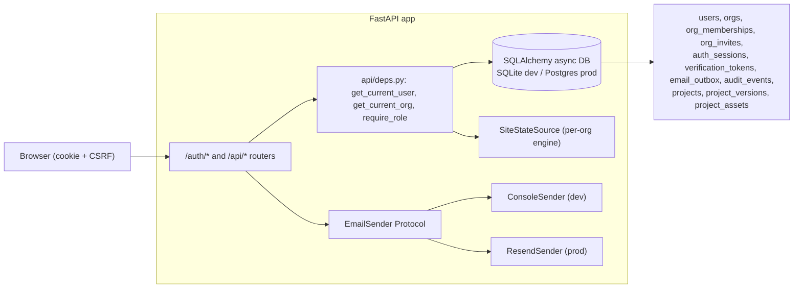

# SiteIQ — Claude Context

Live architecture reference for AI coding agents. Describes the system as
it stands today. Historical bug fixes, completed refactors, and closed
debt live in [`CHANGELOG.md`](CHANGELOG.md) — don't bring them back here.

## What this is

SiteIQ is an interactive demo of a construction site intelligence product.
The thesis: construction sites are catastrophically inefficient — workers
are productive only 35% of their time. SiteIQ uses cameras + CV to observe
everything on a site, quantify waste in euros, and prescribe specific
operational fixes.

For this demo a **simulation engine** replaces real camera feeds. The
simulation generates the same data that real CV would. The demo must make
an investor or construction executive viscerally understand the waste and
see it fixed in real time — in under 3 minutes, no narration needed.

## Architecture

Two intentionally-disconnected systems behind a self-hosted auth layer:

```
                              ┌────────── Frontend (React Router) ──────────┐
                              │  Public:  / /login /signup /forgot-password │
                              │           /reset-password /verify-email     │
                              │           /accept-invite                    │
                              │  Gated /app/*  (RequireAuth):               │
                              │   Dashboard + Settings + Projects/Editor    │
                              └────────────────┬────────────────────────────┘
                                               │ cookie + CSRF
                                               ▼
SIMULATION (the demo)                    VISION (proof-of-concept)
┌──────────────────────┐                 ┌─────────────────────────┐
│ SimulationEngine     │                 │ VideoDetector           │
│ - 50–60 workers FSM  │                 │ - YOLOv8n on .mp4 files │
│ - equipment duty     │                 │ - base64 JPEG frames    │
│   cycles             │    NO LINK      │ - bounding box coords   │
│ - position trails    │◄──────────────►│ - confidence scores     │
│ - analytics/waste    │                 │                         │
│ - recommendations    │                 │ Serves: /ws/camera/{id} │
│ Serves: /ws (10Hz)   │                 └─────────────────────────┘
│         /api/*       │                            ▲
└──────────┬───────────┘                            │ all gated by
           │ all gated by Depends(get_current_org)  │ Depends(get_current_org)
           └────────────────┬───────────────────────┘
                            ▼
                ┌──────────────────────────────────┐
                │ FastAPI app                      │
                │  /auth/*  /api/*  /api/orgs/*    │
                │  CSRF middleware + Origin check  │
                │  CORS  Error envelope handler    │
                │  app.state: db engine, email     │
                │  sender, limiter, source, recs   │
                └──────────────┬───────────────────┘
                               ▼
                ┌──────────────────────────────────┐
                │ SQLAlchemy async (SQLite|Postgres)│
                │ users, orgs, memberships, invites│
                │ sessions, tokens, outbox, audits │
                │ projects, project_versions,      │
                │ project_assets                   │
                └──────────────────────────────────┘
```

The camera feeds and the simulation are still not synchronized — see the
"Open architectural debt" section. The product story is "cameras →
intelligence → decisions" but today's demo shows two unrelated systems
side by side.

### What "Live Mode" should eventually look like

```
Real cameras → YOLO inference → Camera calibration → 2D site map
                                (pixel → meter transform)
                                        │
                                        ▼
                              Same analytics/optimization
                              pipeline as simulation mode
```

The simulation engine would be replaced by real detection data projected
onto the site plan. The `SiteStateSource` Protocol seam already supports
this — a future `LiveSource` drops in by changing only the registry's
`EngineFactory`.

## Tech stack

| Layer | Technology |
|-------|-----------|
| Backend | Python 3.13, FastAPI, uvicorn, WebSocket, Pydantic v2, pydantic-settings |
| Persistence | SQLAlchemy 2.0 async, Alembic, aiosqlite (dev/test) / asyncpg (prod) |
| Auth | argon2-cffi (passwords), opaque server-side sessions, slowapi (rate limit), httpx (Resend) |
| Frontend | React 19, Vite 8, TypeScript 6, Tailwind CSS 3, HTML5 Canvas |
| Frontend libs | react-router-dom v6, react-hook-form, zod, @zxcvbn-ts (lazy), sonner |
| CV | ultralytics (YOLOv8n), opencv-python-headless |
| Package mgmt | uv (backend), npm (frontend) |
| Real-time | WebSocket at 10 Hz for sim state, ~5 Hz for camera frames |

## Running the app

```bash
# Backend
cd backend
uv sync
uv run alembic upgrade head           # creates ./siteiq.db on first run
uv run uvicorn main:app --host 0.0.0.0 --port 8000

# Frontend
cd frontend
npm install
npm run dev
# → http://localhost:5173
```

Settings are read from `backend/.env` (see `backend/.env.example` for
every `SITEIQ_*` knob). In dev mode the verification + reset emails are
persisted to the `email_outbox` table and visible at
`http://localhost:8000/dev/outbox` — no SMTP setup needed.

Camera feeds require .mp4 files in `backend/vision/videos/`. Two Pexels
CC0 videos are downloaded but gitignored. YOLO weights (`yolov8n.pt`)
auto-download on first run.

## Design principles (do not violate)

1. **One canonical document.** `backend/models/project_document.py`
   defines `ProjectDocument`. It is the storage format, the API
   payload, the editor's state, and the simulation engine's input. The
   only transformation is `simulation.project_loader.build_engine_state(doc)`.
2. **Content-addressed immutable versions.** Every save writes a new
   `project_versions` row whose PK is `sha256(canonical_json(document))`.
   `projects.current_version_id` is a single mutable FK — atomic swap,
   no draft/publish state machine.
3. **The seam is sacred.** `SiteStateSource` Protocol is the contract
   between state producers (simulation, future LiveSource) and consumers
   (analytics, optimization, API, renderer). Don't bypass it.
4. **No module-level globals.** Long-lived objects live on `app.state`
   and are injected via FastAPI `Depends`. The one documented exception
   is `renderer.ts`'s `S/OX/OY` — see comment at the declaration site.
5. **Editor = thin reducer over the same Pydantic schema.** OCC via
   `If-Match: <version_id>`, no CRDTs.
6. **Multi-level via discrete `level_id` + a connection graph.** Vertical
   transport is BFS on a small graph, not 3D pathfinding.

## Auth, orgs, persistence

Self-hosted auth in front of every `/api/*` and WebSocket route. SQLite
for dev/test, Postgres for prod — one async SQLAlchemy 2.0 engine
selected via `SITEIQ_DATABASE_URL`.



### Sessions, not JWTs
Opaque tokens live in `auth_sessions`; the cookie holds the plaintext,
the DB holds `sha256(token)`. Revocation, sliding expiry, and "sign out
everywhere" are all single SQL updates. Cookie name uses the `__Host-`
prefix when `SITEIQ_COOKIE_SECURE=true` so browsers enforce Path=/, Secure,
no Domain.

### CSRF
Double-submit cookie (`siteiq_csrf` cookie + `X-CSRF-Token` header) plus
an `Origin` allow-list checked on every state-changing request. WebSockets
share the same Origin allow-list and re-verify the session cookie at
upgrade.

### Email
`EmailSender` Protocol mirrors the `SiteStateSource` seam. `ConsoleSender`
persists to `email_outbox`; the same rows are visible at `/dev/outbox`
when `SITEIQ_ENV=dev`. `ResendSender` posts to api.resend.com via httpx
and updates the same row's status. Tests assert against the outbox.

### Orgs + roles
Signup auto-creates an Org named after the company; the user is its
owner. Roles (`owner > admin > member > viewer`) are checked via
`Depends(require_role(Role.ADMIN))`. Invites are 7-day single-use tokens
keyed to the invitee's email. Every membership change writes an
`audit_events` row (visible to owners on Settings → Team).

### Magic-link login
Passwordless alternative path. `POST /auth/request-magic-link`
(rate-limited, silent on unknown emails) drops a 15-minute single-use
token in the user's email. `POST /auth/login-with-token` consumes the
token. Replays return `token_used`. UI at `/magic-link`, reachable from
`LoginPage`.

### Rate limiting
slowapi limiter as a module-level singleton in `auth/rate_limit.py`
(required because `@limiter.limit("…")` captures it at decoration time).
Wired on:
- `POST /auth/signup` — 5 / hour / IP (signup-spam guard)
- `POST /auth/login` — 10 / minute / IP (brute-force guard)
- `POST /auth/forgot-password` — 5 / hour / IP (email-cost guard)

Storage is in-memory; `SITEIQ_RATE_LIMIT_REDIS_URL` swaps to Redis at
lifespan start for multi-worker deployments. 429s go through the standard
`{error: {code: "rate_limited", message}}` envelope.

### Security headers
`api/security_headers.py` is a **pure ASGI middleware** (not
`BaseHTTPMiddleware` — the latter deadlocks `TestClient` when stacked
≥3 deep). Adds on every response:

- `X-Content-Type-Options: nosniff`
- `X-Frame-Options: DENY`
- `Referrer-Policy: strict-origin-when-cross-origin`
- `Permissions-Policy: geolocation=(), microphone=(), camera=(), payment=()`
- `Content-Security-Policy` — `default-src 'self'`, frame-ancestors
  blocked, object-src blocked, `connect-src` whitelist includes
  `api.pwnedpasswords.com` for the HIBP breach check
- `Strict-Transport-Security: max-age=31536000; includeSubDomains` —
  **only when `env=prod`** (would lock localhost into HTTPS upgrades)

### Request-id middleware
`api/request_id.py` — pure ASGI middleware, **outermost layer**. Reads
incoming `X-Request-Id` or generates a UUID hex, binds it to a
`contextvars.ContextVar`, echoes it on the response. `logging_config.RequestIdFilter`
reads the ContextVar and stamps every log record with `request_id=…`. The
error envelope includes `request_id` so users can paste it into support
tickets.

### Health, readiness, version
- `GET /healthz` — liveness, returns 200 + `{"status": "ok"}` while the
  process is up. Used by Dockerfile + docker-compose healthchecks.
- `GET /readyz` — readiness, returns 200 only when the DB is reachable
  AND the simulation registry is initialised. 503 otherwise.
- `GET /api/version` — returns `{commit, built_at, short}`. Reads
  `SITEIQ_COMMIT_SHA` + `SITEIQ_BUILT_AT` env first; falls back to a
  `version.txt` file the Dockerfile stamps at build time. Surfaced in
  the SettingsLayout footer.

All three are unauthenticated GETs (sail past CSRF).

### Background cleanup tasks
Both lifecycle tasks drain on shutdown — without that, an in-flight
cleanup can race the engine shutdown and the lifespan never returns.

- `auth/outbox_cleanup.py` — deletes `email_outbox` rows older than
  `SITEIQ_EMAIL_OUTBOX_RETENTION_DAYS` (default 90) every
  `SITEIQ_EMAIL_OUTBOX_CLEANUP_INTERVAL_SECONDS` (default 3600).
  Retention `0` disables.
- `auth/auth_cleanup.py` — drops fully-revoked / expired `auth_sessions`
  and consumed / expired `verification_tokens` past their retention
  windows (`SITEIQ_AUTH_SESSION_RETENTION_DAYS`, `SITEIQ_AUTH_TOKEN_RETENTION_DAYS`).

### Per-org simulation engines
`backend/state/registry.py` is the registry for `SimulationEngine` +
`RecommendationService` instances, keyed by `org_id`. `Depends(get_source)`
resolves the active org first and looks up (or lazily creates) that org's
engine. The simulation tick loop iterates every live engine. Side effects:

- Two orgs viewing the dashboard see different sites.
- WebSocket auth (`api/ws_auth.py`) returns the session's
  `current_org_id`; the WS handler uses it to look up the right engine.
- Account / workspace deletion calls `registry.discard(org_id)` so the
  engine + analytics + recs are reclaimed immediately.

`orgs.active_project_id` (migration `0002_orgs_active_project`) persists
each org's chosen `PROJECT_TEMPLATES` key. `orgs.active_project_version_id`
(migration `0003_projects`) pins the project version for the
content-addressed editor flow.

### Account + workspace deletion
- `POST /auth/delete-account` — re-supplies the password, then deletes
  the user. For each org the user owned: if there's another owner, only
  the membership goes; if they were the last owner, the org is deleted
  entirely (cascade drops memberships, invites, audit_events, and the
  registry's engine).
- `DELETE /api/orgs/current` — owner-only. Two confirmations: type the
  workspace name + re-supply the password. Sessions whose `current_org_id`
  pointed at the deleted org get nulled — they fall back to another
  membership next request rather than logging out.
- Both record `org.deleted` / `user.deleted` audit events before the
  cascade so an admin can forensically reconstruct what happened.

### Audit log CSV export
`GET /api/orgs/current/audit.csv?since=…&until=…` streams up to 10k rows
of audit events as RFC 4180 CSV. Owner-only. Frontend Team settings
links via `<a download href={orgs.auditCsvUrl()}>` so the browser
handles the file save with the auth cookie attached. Bad timestamps
return `{error: {code: "invalid_timestamp", field}}`.

### Portfolio waste estimator
`services/portfolio_estimator.py` warms a transient `SimulationEngine`
per project template at app startup (240 ticks ≈ 2 sim-hours), runs
`compute_waste_summary` once, caches on `app.state.portfolio_estimates`.
Each `/api/portfolio` card shows real per-project numbers. Tests turn
the warm-up off via `SITEIQ_COMPUTE_PORTFOLIO_AT_STARTUP=false` to keep
TestClient lifespans fast — they fall back to the legacy formula
(acceptable for unit tests; integration smoke covers the live path).

### Frontend resilience
- `src/lib/ErrorBoundary.tsx` wraps the entire router. Anything thrown
  during render becomes a clean recovery card with stack trace + Reload.
- `src/hooks/useConnectionToast.ts` watches the WS `connected` flag.
  After a 2 s grace, drops a sticky "Reconnecting…" toast; on reconnect
  it auto-replaces with a 2.5 s "Live again" success.
- All routes are split via `React.lazy` + `Suspense`. Initial bundle
  ~243 KB; each settings page is 1–8 KB on its own.

## Backend modules

### `config.py`
Domain constants only (rates, intervals, sim-clock parameters).
Operational knobs live in `settings.py` instead. Key tunables:
`TOILET_INTERVAL` (7200 s = 2 h), `MATERIAL_RUN_INTERVAL` (7200 s),
equipment hourly rates (€180/120/90 for crane/pump/excavator),
`SIM_SECONDS_PER_TICK` (30 — each 100 ms real tick = 30 s sim time at
1× speed).

### `settings.py`
`Settings` (pydantic-settings `BaseSettings`) with `SITEIQ_*` env
overrides. Beyond CORS / log / YOLO knobs, the auth-era fields:
`env` (`dev|prod|test`), `database_url`, `frontend_origin`,
`session_secret`, `session_cookie_name`, `session_lifetime_days`,
`session_idle_days`, `cookie_domain`, `cookie_secure`, `email_provider`
(`console|resend`), `resend_api_key`, `email_from`, `rate_limit_redis_url`.
Convenience properties: `is_prod`, `is_dev`, `effective_cookie_secure`
(defaults `True` in prod, `False` in dev). Documented in `.env.example`.

### `logging_config.py`
`configure(level, fmt)` installs one stream handler on the root logger.
`fmt="json"` swaps in `python-json-logger`'s `JsonFormatter`. Idempotent.
Every module uses `logging.getLogger(__name__)`. **Zero `print(...)`
calls; zero bare `except Exception: pass`** (guarded by `test_logging.py`).

### `state/`
- **`source.py`** — `SiteStateSource` Protocol (`@runtime_checkable`).
  Surface: `project_id`, `sim_time`, `sim_day`, `site`, `assets`,
  `asset_by_id`, `zone_by_id`, `workers_in_zone`, `worker_internals_for`,
  `activity_log_for`, `position_history_for`. Multi-level additions:
  `levels`, `level_by_id`, `workers_in_level`, `connections`,
  `connections_from_level`.
- **`registry.py`** — `SourceRegistry` keyed by `org_id`. `for_org(slug)`
  for seed-slug loads, `for_org_at_version(org_id, doc, version_id)` for
  content-addressed activation. Tags engine-in-place when slug + null
  version match the activating document (avoids tearing down legacy
  seed-loaded engines).

### `models/`
Pydantic v2 schemas. `Site` has zones + schedule. `Asset` has position,
state, metadata. `WasteSummary` aggregates costs. `Recommendation.from_position`
/ `to_position` use the typed `PositionXY` model.
`Asset.to_broadcast_dict()` produces the compact WebSocket payload —
flat dict with id, type, subtype, x, y, state, assigned_zone, lvl.

### `models/project_document.py` — canonical schema

```python
class Discipline(str, Enum):
    HOCHBAU = "hochbau"      # above-ground building
    TIEFBAU = "tiefbau"      # civil / underground
    HYBRID  = "hybrid"

class Phase(str, Enum):
    EXCAVATION; SHORING; PILING; DRAINAGE      # Tiefbau additions
    FOUNDATION; STRUCTURAL; MEP_ROUGHIN
    CLOSEIN; FINISHES; PAVING; COMPLETE        # PAVING added

class Level(BaseModel):
    id: str           # "L0", "L-1", "L1"
    name: str         # "EG", "UG1", "1. OG"
    elevation_m: float
    order: int
    background_image_url: str | None

class Position(BaseModel):
    x: float; y: float
    level_id: str = "L0"   # default keeps legacy data compatible

class Connection(BaseModel):
    id: str
    kind: Literal["stair", "elevator"]
    nodes: list[ConnectionNode]   # (level_id, x, y)
    cab_capacity: int = 6
    cycle_time_s: float = 60.0
    speed_m_per_s: float = 1.5
    seconds_per_level_climb: float = 20.0  # stairs only

class ProjectDocument(BaseModel):
    schema_version: int = 1
    slug, name, description, type, discipline
    width, height, start_day
    levels: list[Level]
    zones: list[Zone]              # carries level_id
    facilities: list[FacilitySpec] # carries level_id
    equipment: list[EquipmentSpec] # carries level_id
    materials: list[MaterialSpec]  # carries level_id
    connections: list[Connection]
    schedule: list[ScheduleEntry]
    worker_seeds: list[WorkerSeed] # per (zone_id, trade) → count

    def content_hash(self) -> str:
        return sha256(canonical_json(self)).hexdigest()
```

### `simulation/`
- **`site_factory.py`** — `PROJECT_TEMPLATES` is a thin lazy view that
  loads from `backend/seeds/projects/*.json`. Four seeds today:
  residential Berlin, commercial Frankfurt, infrastructure Munich,
  Munich sewer (Tiefbau).

- **`project_loader.py`** — `build_engine_state(doc)` materialises
  `(Site, list[Asset], dict[worker_id, WorkerInternals], list[Connection])`
  from a `ProjectDocument`. The only doc→engine translation.

- **`engine.py`** (~140 LOC, down from 243) — `SimulationEngine`
  implements `SiteStateSource`. Owns `assets`, `site`, `worker_internals`,
  `position_history`, `activity_log`, plus O(1) indexes (`_by_id`,
  `_facilities_by_subtype`, `_facilities_by_subtype_level`,
  `_workers_by_zone`, `_connections_by_level`) rebuilt on every project
  switch via `rebuild_indexes()`. `tick()` advances the FSM;
  `get_state_snapshot()` produces the WS broadcast payload.

- **`worker_internals.py`** — `@dataclass WorkerInternals` typed state
  per worker (FSM timers, dwell counters, daily-reset stats,
  `target_level_id`, `cross_level_destination`, `vertical_connection_id`,
  `vertical_queue_enter_time`, `time_in_vertical_transport`).
  `reset_daily()` clears day-level counters.

- **`worker_behavior.py`** — Worker FSM with dispatch table:
  `STATE_HANDLERS: dict[WorkerState, StateHandler]` maps each state to a
  single-purpose `_on_*` handler. Adding a state = write a handler + add
  one line. Uses engine's indexed lookups via the local `_WorkerEngine`
  Protocol. **Strict-mypy clean.** `_find_nearest_facility` prefers a
  same-level facility, falls back cross-level only when none exists on
  the worker's current floor. `_begin_vertical_route` BFSes the
  connection graph and sets `WALKING_TO_VERTICAL` if the destination is
  on a different level.

- **`vertical_transport.py`** — one `CabState` per elevator
  `Connection`: `current_level_id`, `direction (+1/-1/0)`,
  `passengers: list[(worker_id, target_level_id)]`,
  `queue_per_level: dict[level_id, deque[worker_id]]`, `door_open_remaining_s`.
  `tick_cab(cab, dt_sim, on_alight, on_board)` advances the cab and
  dispatches callbacks. Long sim ticks (sim runs up to 20× real-time)
  loop through multiple floor stops so cab position stays consistent
  with worker movement. **Microbench gate**: 6 cabs × 250 workers × 6
  levels averages < 5 ms/tick. Locked in
  `tests/test_vertical_transport.py::test_tick_under_5ms_with_six_cabs_and_workers`.

- **`equipment_behavior.py`** — Alternates OPERATING ↔ IDLE on duty
  cycles (crane 40/30 min, pump 10/40 min, excavator 42/18 min). Tracks
  `hours_active` / `hours_idle`.

- **`tiefbau_behavior.py`** — `update_tiefbau_equipment`: dewatering
  pumps run 80% / 20% duty cycle; sheet piles stay permanently
  OPERATING. `compute_shoring_compliance` returns a per-EXCAVATION-zone
  score: 1.0 if a sheet pile is within `SHORING_INFLUENCE_RADIUS_M = 25`
  of the zone's centre, 0.0 otherwise. New subtypes: `sheet_pile`,
  `dewatering_pump`. Engine dispatch in `_tick()` routes these subtypes
  to `update_tiefbau_equipment` instead of `update_equipment`.

- **`asset_detail.py`** — `asset_detail(source, asset_id)` builds the
  rich per-asset detail view. Dispatch table `DETAIL_BUILDERS` routes by
  `asset.type` to `_worker_detail` / `_equipment_detail` /
  `_facility_detail` / `_material_detail`. Per-type radius + state
  tables for facility occupancy.

### `analytics/` (all take `source: SiteStateSource`)
- **`travel.py`** — `compute_travel_metrics(source)`. Per-zone metrics:
  avg toilet round-trip, trips/day, daily walk cost (trips × RT ×
  hourly_rate), productivity rate. Extrapolates partial-day data via
  `day_fraction`.
- **`utilization.py`** — `compute_equipment_utilization(source)`. Per-equipment:
  utilization rate, daily idle cost (normalized to 11h workday ×
  idle_fraction × rate).
- **`vertical_metrics.py`** — `compute_vertical_metrics(source)`. Per-worker
  `time_in_vertical_transport` extrapolated to a full day → `waste_daily`
  in €. Per-cab snapshot: `queued_now`, `riding_now`, `saturation`,
  `longest_wait_s`.
- **`aggregator.py`** — `compute_waste_summary(source)`. Combines travel
  + equipment + vertical into `WasteSummary` with daily and monthly
  totals. WasteSummary's `vertical_transport_daily` / `_monthly` is
  rendered only when > 0 (single-floor sites stay clean).

### `optimization/` (all take `source: SiteStateSource`)
- **`facility_placement.py`** — Weighted k-means (k=2) **per level** —
  toilets can't move across floors. Greedy-nearest pairing assigns
  toilets to centroids.
- **`material_staging.py`** — Picks the zone edge closest to the
  material's current position (preserves gate-side logistics flow).
- **`equipment_schedule.py`** — Flags equipment < 40% utilization for
  release, < 60% for rescheduling. `daily_idle_hours = (1 - utilization)
  × 11h` (stable from t=0).
- **`vertical_transport_optimizer.py`** — Fires on instantaneous
  saturation ≥ 60% or longest queue wait ≥ 60 s, OR cumulative daily
  waste per cab ≥ €5/day. Recommendation: "Add a second cab next to
  {connection_id}", estimated savings = `avg_daily_per_cab / 2`.

### `services/`
- **`recommendation_service.py`** — `RecommendationService(source,
  optimizers=…)`. Owns the recommendation cache; tracks the project id
  of the cached set and auto-invalidates on mismatch. `get()`, `clear()`,
  `mark_dirty()`, `by_id()`. Constructed once per app at lifespan
  startup, injected via `Depends(get_rec_service)`.
- **`portfolio_estimator.py`** — see "Auth, orgs, persistence" above.

### `api/`
- **`deps.py`** — FastAPI dependency providers. Domain: `get_source`,
  `get_rec_service`, `get_detector`, `get_analytics`, `get_settings`,
  `get_email_sender` (all 503 if `app.state` isn't ready). Auth:
  `get_optional_session`, `get_current_session`, `get_current_user`,
  `get_current_org`, `get_current_membership`, `require_role(min: Role)`
  (closure-style Depends, returns 403 below threshold).
- **`routes.py`** — REST routes, all wrapped in `Depends(get_current_org)`.
  GET `/api/projects`, `/api/portfolio`, `/api/site`,
  `/api/recommendations`, `/api/assets/{id}`, `/api/simulation/state`,
  `/api/simulation/heatmap`. POST `/api/site/load-seed`,
  `/api/recommendations/{id}/apply`, `/api/recommendations/apply-all`,
  `/api/simulation/speed`, `/api/simulation/pause`. Sim-only controls
  return 501 if the source isn't a `SimulationEngine`.
- **`projects.py`** — content-addressed project CRUD (see
  "Editor + multi-level" below).
- **`project_assets.py`** — background image upload + serve. Multipart
  parser via `python-multipart`.
- **`websocket.py`** — WS `/ws` streams `state_update` at 10 Hz (assets
  + trails + latest analytics). Auth: cookie + origin checked at upgrade
  via `api/ws_auth.py`.
- **`camera.py`** — GET `/api/cameras` lists video feeds. WS
  `/ws/camera/{video_id}` streams YOLO-processed frames at ~5 Hz via
  `asyncio.to_thread()` so inference doesn't stall the event loop.
- **`ws_auth.py`** — `authenticate_ws(websocket)`: rejects unknown
  Origins with close code 4403, missing/invalid session with 4401.
  Shared by both WebSocket endpoints.
- **`dev.py`** — `/dev/outbox` (mounted only when `env=dev`). Lists
  recent 100 emails; `/dev/outbox/{id}/html` serves the rendered body.

### `vision/`
- **`detector.py`** — `VideoDetector` wraps YOLOv8n. Loads all .mp4
  from `vision/videos/`, reads frames with OpenCV, runs inference
  (conf=0.20), returns base64 JPEG + normalized bounding boxes.
  CLASS_REMAP maps COCO classes to construction labels ("person" →
  "Worker"). ~18 ms inference per frame on Apple Silicon.

### `db/`
- **`project_repository.py`** — only place that translates between
  `ProjectDocument` and DB rows. `save_version(project_id, doc,
  parent_version_id, …)` raises `OptimisticLockError` if
  `parent_version_id` no longer matches the project's current pointer,
  which the router surfaces as a 409 `version_conflict`.

### `seeds/`
- **`importer.py`** — imports every bundled JSON seed as a public-template
  row at app startup. Idempotent via content hash: identical seeds
  dedupe; edited seeds bump the version.

### `main.py`
Thin composition root. `create_app(settings=None)` builds an isolated
FastAPI app (tests can pass custom settings). Lifespan handler
constructs the async DB engine + session factory, the `EmailSender`
(Console or Resend), the slowapi limiter, the `SimulationEngine`, the
`RecommendationService` and the `VideoDetector` — all attached to
`app.state`. Spawns `run_simulation_loop` + `_run_analytics_loop`.

Middleware order: request-id (outermost) → CORS → CSRF (double-submit
cookie + Origin allow-list, exempts `/auth/csrf` + `/ws/*`) →
security-headers → routers (`/auth`, `/api/orgs`, `/api`, `/ws`,
`/ws/camera`, plus `/dev/*` only in dev). A custom exception handler
converts `HTTPException` and `RequestValidationError` into the standard
`{error: {code, message, field?}}` envelope.

## Editor + multi-level (live architecture)

### Persistence

Alembic migration `0003_projects` adds:

- `projects(id, org_id, slug, name, description, type, discipline,
  visibility, status, current_version_id, …)` — top-level row, `org_id=NULL`
  for public templates.
- `project_versions(id, project_id, parent_version_id, document JSONB,
  message, created_by_user_id, created_at)` — immutable. `id` is the
  SHA-256 content hash.
- `orgs.active_project_version_id` — pointer at the version the org's
  simulation runs on.

Migration `0004_project_assets` adds `project_assets(id, project_id FK
cascade, kind, content_type, data LargeBinary, content_hash)` for
background floor-plan blobs.

### Project router

All routes wrapped in `Depends(get_current_org)` + `require_role(Role.ADMIN)`
for writes.

| Route | Method | Purpose |
|-------|--------|---------|
| `/api/projects` | GET | List org-owned + public-template projects (incl. `is_active` flag) |
| `/api/projects` | POST | Create new draft (returns full document) |
| `/api/projects/{id}` | GET | Full document, version id, visibility, ownership |
| `/api/projects/{id}` | PUT | Save new version. `If-Match: <version_id>` required for OCC. Validation errors as `400 {code, message, field}`. |
| `/api/projects/{id}` | DELETE | Soft via cascade |
| `/api/projects/{id}/activate` | POST | Pin org's simulation to this project/version |
| `/api/projects/{id}/validate` | POST | Dry-run validation; live editor feedback |
| `/api/projects/{id}/preview` | POST | Transient engine, `ticks` (default 240, max 1200), returns snapshot + waste + recs. Rejects docs with `severity="error"` validation issues. |
| `/api/projects/{id}/levels/{level_id}/background` | POST | Multipart upload. `image/{png\|jpeg\|webp}`, ≤ 2 MiB. Inserts blob + writes new version with `Level.background_image_url`. `If-Match` honoured. |
| `/api/projects/{id}/levels/{level_id}/background` | DELETE | Strips url + drops asset row in one transaction. |
| `/api/projects/{id}/assets/{asset_id}` | GET | Serves bytes with `Cache-Control: public, max-age=31536000, immutable` and content hash as `ETag`. |

Every mutating endpoint writes an `audit_events` row: `project.created`,
`project.updated`, `project.deleted`, `project.activated`,
`project.preview`, `project.background.uploaded`,
`project.background.deleted`.

`/api/site/load-seed {slug}` is kept for the dashboard's stock-project
switcher; it's a no-op when `source.project_id == req.slug`.

### Editor GUI

Routes:
- `/app/projects` — list of org-owned + public-template projects with
  Edit / Activate / Duplicate actions. Active project shown with green
  `● Active` pill and disabled "Activated" button.
- `/app/projects/:id/edit` — the editor.

Components in `frontend/src/components/editor/`:
- **`ToolPalette.tsx`** — categorised tool buttons (Zone / Facility /
  Vertical / Equipment / Tiefbau).
- **`LevelManager.tsx`** — add/rename/remove levels (L0 protected); per-row
  "📐" uploads a background image.
- **`PropertiesPanel.tsx`** — context-sensitive editor for the currently
  selected zone / facility / equipment / material / connection. Worker
  seeds edited inside the zone view.
- **`EditorCanvas.tsx`** — focused 2D drawing for editor mode (separate
  from the runtime renderer). Click-to-select in select mode;
  click-to-place when a placement tool is active. Snap-to-grid pills
  (0/1/5/10 m, default 1 m, persisted to
  `localStorage.siteiq.editor.grid_size`). Grid dots auto-step up
  (1m → 2m → 4m → 8m) until ≥ 6 CSS pixels of separation. 3 px
  click→drag threshold; coarse-grain undo (one patch per drag). Label
  collision detection mirrors `renderer.ts`.
- **`ScheduleEditor.tsx`** — right-column "Schedule" tab. One row per
  zone, ordered like `LevelManager`. Drag a `ProjectScheduleEntry` block
  horizontally → shifts `start_day` and `end_day` together; drag left
  handle → only `start_day`; drag right handle → only `end_day`. Snap
  to 1-day grid. "+ Phase" opens an inline picker. One coarse-grain
  `patch` per drag on mouseup.
- **`PreviewRunPanel.tsx`** — non-modal sidebar with daily/monthly waste
  + top 5 recommendations. Auto-dismisses when the draft mutates.
- **`ValidationOverlay.tsx`** — surfaces errors / warnings from
  `POST /api/projects/{id}/validate`.

State management via `frontend/src/hooks/useProjectDraft.ts`:
- `useReducer` over `{ current, past, future, savedVersionId }` for
  instant undo/redo.
- Autosave every 5 s if dirty, posting `PUT /api/projects/{id}` with
  `If-Match: <savedVersionId>`. Conflict → sets `conflict=true` (UI
  shows "⚠ conflict — reload").
- Debounced live validation (800 ms) → `setIssues`.
- `applyServerUpdate(detail)` callback clears undo/redo (the new version
  IS the new ground truth).

Activate from the editor header → `POST /api/projects/{id}/activate` →
navigate back to the dashboard. The next `get_source` call detects the
version drift and rebuilds the engine on the new document.

## Frontend modules

### State management
- `App.tsx` is a `BrowserRouter`. Simulation app body lives in
  `pages/Dashboard.tsx`, mounted at `/app` behind `<RequireAuth>`.
- `lib/auth/AuthProvider` — context that boots via `GET /auth/me`,
  exposes `useAuth()` (`status`, `user`, `org`, `memberships`, `refresh`,
  `setMe`). `RequireAuth` redirects to `/login?next=…`; `RequireRole`
  shows an "Access denied" panel below threshold.
- `useWebSocket` — connects to `${WS_BASE}/ws`, stores assets + trails
  in **refs** (not state) for canvas performance. Only analytics, simTime,
  simDay trigger React re-renders. Reconnect guard skips OPEN *or*
  CONNECTING sockets.
- `useSimulation` — fetches `/api/site` on mount. `reload()` re-fetches
  after project switch.
- `useAnalytics` — captures first analytics as baseline, computes
  savings delta. `resetBaseline()` clears on project switch.
- `Dashboard.tsx` resets selection / recs / baseline whenever the active
  org id changes.

### `services/api.ts`
Extends `getJson` / `postJson` with `credentials: 'include'` and an
`X-CSRF-Token` header sourced from `/auth/csrf`. All errors throw
`ApiError` so forms can render `error.field`. Exports `API_BASE` and
`WS_BASE` — the single source of truth for URLs.

### Canvas rendering (`renderer.ts`, ~970 LOC)
Module-level coordinate helpers `px()`, `py()`, `ps()` set from
scale/offset each frame. The `S/OX/OY` globals are the one documented
exception to the no-globals rule — see comment at the top of the file.

Draw order: ground → roads → fence → zone structures (phase-specific:
excavation contours, foundation grids, structural columns, MEP conduit
routes, finishes partitions) → heatmap → trails → materials → facilities
→ equipment → workers → recommendation arrows → selection highlight →
zone labels → scale bar → legend.

Workers rendered as emoji (👷) with trade-colored dot underneath.
Equipment as emoji (🏗️🚛🚜) with status ring and ACTIVE/IDLE label.
Facilities as emoji (🚻☕🏢🔧) on background plates. Materials as emoji
(🪨🔌🧱🪣). Selection: pulsing orange ring + tooltip; selected worker's
trail at full opacity, others dimmed to 4%.

Label collision detection: every label-draw helper
(`drawEquipmentTopDown`, `drawMaterialStacks`, `drawZoneLabels`,
`drawRecommendationArrows` cost chips) keeps a per-call painted-rectangle
list and skips new labels that would overlap. Friendly subtype labels
in the `LABELS` table (`sheet_pile` → "SHORING", `dewatering_pump` →
"PUMP").

### `CameraFeed.tsx`
Connects to `${WS_BASE}/ws/camera/{videoId}` with exponential-backoff
reconnect (1 s → 10 s cap). Receives base64 JPEG + detection data.
Renders video frame on canvas, overlays bounding boxes with corner
brackets, class labels, confidence %, inference time, detection count
HUD. Shows "● REC" indicator and "YOLOv8 · SiteIQ Vision" badge. Stats
in refs so the RAF loop mounts once.

### `SiteMap.tsx`
Canvas container with pan (drag), zoom (scroll wheel), reset
(double-click). Click detection: converts screen coords → site meters
via scale/offset/zoom/pan back-projection, finds nearest asset within
hit radius, sets `selectedAssetId`. Cursor changes to pointer on hover
over assets; restores to `grab` on mouseUp. Toggle bar: Trails, Heatmap,
Show Fixes, Cameras, Iso View (multi-level only).

Per-mount image cache keyed by absolute URL for level backgrounds. When
the active level has a `background_image_url`, the canvas paints it
once before the dashed site bounds. `renderer.ts` stays untouched; the
runtime SiteMap path temporarily intercepts the two specific
`ctx.fillRect` calls inside `drawSiteGround` (`fillStyle === '#f0ede8'
|| '#d4c9a8'`) so the floor plan survives underneath. Intercept is
restored before the cab overlay runs.

### `SiteMap/LevelSwitcher.tsx`
Vertical strip on the **left** of the canvas (renderer's legend lives
top-right), top-to-bottom by `order` descending. Renders nothing on
single-floor projects. `SiteMap.tsx` manages `activeLevel` state,
filters zones (`zone.level_id === activeLevel`) and assets
(`a.lvl === activeLevel`) before passing to the renderer.

### `SiteMap/IsoRenderer.ts`
2.5D iso compositor. Renders each level to an `OffscreenCanvas` via the
existing `renderFrame`, then stacks them at a ~30° iso angle on the
parent canvas. One `LevelSlab` per level, cached with a dirty-hash
(per-level asset positions + render flags). Only redraws slabs that
changed since the last frame. Single-floor sites short-circuit to
regular `renderFrame` — zero cost when iso is off. `resetIsoSlabs()`
clears the cache on project switch.

### Right panel
Tabbed: Waste / Optimize / Timeline. Asset detail replaces tabs when
an asset is selected.

- **WasteReport** — Red "RECOVERABLE WASTE" hero with monthly + daily
  framing. ROI card (system cost €2K/mo vs savings, payback ratio).
  "Included at no extra cost" card showing BauWatch/PPE/Buildots
  replacements. Three expandable cost rows with zone/equipment
  breakdowns. Green CTA "Apply optimizations — recover €X/mo" links to
  Optimize tab. Vertical-transport row rendered only when > 0.
- **Recommendations** — "Available Savings" banner with monthly + annual
  total. "Apply All N Optimizations" button with spinner state.
  Individual rec cards with Apply buttons. Post-apply celebration card
  keyed off `celebrationSig` (auto-hides on project switch or new rec
  set; 8 s timer fallback). Applied list at bottom.
- **Timeline** — Gantt chart from schedule data. Takes `zones` as prop;
  `TOTAL_DAYS = max(schedule.end_day, currentDay + 5, 120)`.
- **AssetDetail** — Worker: productivity bar (work/walk/facility split),
  distance, trips, round-trip times. Equipment: utilization gauge, duty
  cycle progress (denominator switches between `operate_duration_s` /
  `idle_duration_s` based on state). Facility: workers present list.
  Material: target zone (uses `needed_in_zone_label` from backend) +
  distance. Activity log with sim-clock timestamps.

### `Portfolio.tsx`
Full-screen view showing all project templates. Summary cards (sites,
workers, equipment, waste). Portfolio ROI banner using
`RECOVERABLE_WASTE_FRACTION = 0.55` + `SYSTEM_COST_PER_SITE = 2000`.
Per-site cards with Open Site button that triggers project switch.

### `pages/settings/*`
Account (change password, resend verification, delete account), Team
(members, invites, audit log for owners — payload values folded to
first-8 chars by `formatAuditPayload`), Workspaces (org switcher),
Sessions (per-device revoke + sign out everywhere).

### `pages/LandingPage.tsx`
Same orange + JetBrains Mono tokens as the dashboard, with a
`LiveWasteCounter` that ticks up while the user reads.

## Design system
Light theme using HSL CSS custom properties (shadcn-style tokens).
Primary = orange (24 80% 50%), destructive = red, success = green,
warning = amber. Inter for UI, JetBrains Mono for numbers. All monetary
values use `tabular-nums` for stable width.

## Test suite

| Suite | Count | Covers |
|---|---|---|
| Backend | **287** | API, auth, orgs, sim FSM, vertical transport, Tiefbau, editor, preview, background upload, project list, microbench gates |
| Frontend | **99** | Sim canvas, auth (AuthProvider, RequireAuth), api.ts, editor (ToolPalette, LevelManager, EditorCanvas, ScheduleEditor, PreviewRunPanel) |

Mypy strict scoped to `simulation/worker_internals.py`,
`simulation/worker_behavior.py`, `state/source.py` — clean.

Microbench gates locked in:
- `test_tick_under_5ms_at_full_load` — 50 ticks of `isar-bridge` average < 5 ms.
- `test_tick_under_5ms_with_six_cabs_and_workers` — 6 cabs × 250 workers
  same budget.

`tests/conftest.py` exposes:
- `engine` / `frankfurt_engine` / `munich_engine` — fresh `SimulationEngine`
  instances.
- `app_settings` — `Settings` pointing at a per-test SQLite file with
  `env=dev`.
- `app_factory` / `client` — applies migrations, swaps in the no-op
  detector + `cheap_hasher` for argon2, builds a `TestClient`.
- `auth_client` — `client` with a real signed-up user + session cookie
  + CSRF header preset; the standard fixture for auth-gated routes.
- `authenticate(client)` / `setup_test_db(url)` — helpers for tests
  that build their own app variants.

## Open architectural debt

- **#33 — Camera feeds are disconnected from simulation.** The core
  coherence problem. The `SiteStateSource` Protocol seam already supports
  a future `LiveSource` that would replace the simulation engine with
  calibrated YOLO detections projected onto the 2D map.
- **#35 — No 2FA UI yet.** The `users.totp_secret` column exists; the
  UI is intentionally hidden behind a future feature flag.
- **#36 — No billing.** `orgs.plan` exists (`trial|pro|enterprise`) but
  Stripe integration is a separate plan.

## API route → frontend mapping

Every `/api/*` route is wrapped in `Depends(get_current_org)` and returns
the standard `{error: {code, message, field?}}` envelope on failure.
Mutating requests carry `credentials: 'include'` + `X-CSRF-Token`.

### Auth

| Backend route | Method | Frontend caller | Notes |
|--------------|--------|----------------|-------|
| `/auth/csrf` | GET | `services/api.ts` (auto) | Sets `siteiq_csrf` cookie + returns body token; cached client-side |
| `/auth/me` | GET | `AuthProvider` boot | `{user, org, memberships}` — `null`s when anonymous |
| `/auth/signup` | POST | `SignupPage` | Creates user + org (owner) + session; sends verification email |
| `/auth/login` | POST | `LoginPage` | Returns `MeResponse` and sets session cookie |
| `/auth/logout` | POST | `SettingsLayout` | Revokes active session, clears cookie + CSRF cache |
| `/auth/forgot-password` | POST | `ForgotPasswordPage` | Always 200 — never reveals whether the email exists |
| `/auth/reset-password` | POST | `ResetPasswordPage` | Single-use token, revokes all sessions, issues fresh |
| `/auth/verify-email` | POST | `VerifyEmailPage` | Single-use token, 24h TTL |
| `/auth/resend-verification` | POST | `AccountSettings` | No-op if already verified |
| `/auth/change-password` | POST | `AccountSettings` | Revokes every other session |
| `/auth/sessions` | GET | `Sessions` | Live (non-revoked, non-expired) sessions |
| `/auth/sessions/{id}/revoke` | POST | `Sessions` | Per-device revoke |
| `/auth/sessions/revoke-all` | POST | `Sessions` | Sign out everywhere; reissues current cookie |
| `/auth/request-magic-link` | POST | `MagicLinkPage` | Silent on unknown emails |
| `/auth/login-with-token` | POST | `MagicLinkPage` | 15-min single-use |
| `/auth/delete-account` | POST | `AccountSettings` | Password re-supplied; cascade |

### Orgs

| Backend route | Method | Frontend caller | Notes |
|--------------|--------|----------------|-------|
| `/api/orgs` | GET | `OrgSwitcher` | All memberships for current user |
| `/api/orgs/switch` | POST | `OrgSwitcher`, `AcceptInvitePage` | Sets `auth_sessions.current_org_id` |
| `/api/orgs/current/members` | GET | `TeamSettings` | member+ |
| `/api/orgs/current/invites` | GET | `TeamSettings` | admin+ |
| `/api/orgs/current/invites` | POST | `TeamSettings` | admin+; sends invite email |
| `/api/orgs/accept-invite` | POST | `AcceptInvitePage` | Token + email-match check |
| `/api/orgs/current/members/{user_id}` | PATCH | `TeamSettings` | admin+; only owners can touch owner roles |
| `/api/orgs/current/members/{user_id}` | DELETE | `TeamSettings` | admin+ |
| `/api/orgs/current/leave` | POST | _future_ | Last-owner protection |
| `/api/orgs/current/audit` | GET | `TeamSettings` | owner only |
| `/api/orgs/current/audit.csv` | GET | `TeamSettings` (download link) | owner only; RFC 4180 |
| `/api/orgs/current` | DELETE | `TeamSettings` danger zone | owner only; name + password confirm |

### Simulation (gated by current org)

| Backend route | Method | Frontend caller | Notes |
|--------------|--------|----------------|-------|
| `/api/portfolio` | GET | `Portfolio.tsx` via `fetchPortfolio()` | On mount |
| `/api/site` | GET | `useSimulation.ts` via `fetchSite()` | On mount + reload |
| `/api/site/load-seed` | POST | `TopBar.handleProjectSelect` | Legacy stock-project switcher; no-op when slug already active |
| `/api/recommendations` | GET | `Dashboard.tsx` | 5s polling |
| `/api/recommendations/{id}/apply` | POST | `Recommendations.tsx` | On click |
| `/api/recommendations/apply-all` | POST | `Recommendations.tsx` | On click |
| `/api/assets/{id}` | GET | `AssetDetail.tsx` | 1.5s polling when selected |
| `/api/simulation/speed` | POST | `TopBar.tsx` | On speed button click |
| `/api/simulation/pause` | POST | `TopBar.tsx` | On pause button click |
| `/api/simulation/state` | GET | *unused by frontend* | Exists as fallback |
| `/api/simulation/heatmap` | GET | `SiteMap.tsx` (when toggled) | Sparse density grid, daily reset |
| `/api/cameras` | GET | `SiteMap.tsx` inline fetch | When cameras toggle enabled |
| `/ws` | WS | `useWebSocket.ts` | 10 Hz sim state stream; cookie + Origin checked at upgrade |
| `/ws/camera/{id}` | WS | `CameraFeed.tsx` | ~5 Hz YOLO frame stream; same auth |

### Projects (editor)

| Backend route | Method | Frontend caller |
|--------------|--------|-----------------|
| `/api/projects` | GET | `ProjectListPage`, `TopBar` |
| `/api/projects` | POST | `ProjectListPage` (Create / Duplicate) |
| `/api/projects/{id}` | GET | `useProjectDraft` |
| `/api/projects/{id}` | PUT | `useProjectDraft` (autosave, `If-Match`) |
| `/api/projects/{id}` | DELETE | _no UI yet, exposed for completeness_ |
| `/api/projects/{id}/activate` | POST | `ProjectListPage`, `ProjectEditorPage` (header) |
| `/api/projects/{id}/validate` | POST | `useProjectDraft` (debounced) |
| `/api/projects/{id}/preview` | POST | `PreviewRunPanel` |
| `/api/projects/{id}/levels/{level_id}/background` | POST | `LevelManager` (📐 button) |
| `/api/projects/{id}/levels/{level_id}/background` | DELETE | `LevelManager` (clr) |
| `/api/projects/{id}/assets/{asset_id}` | GET | `EditorCanvas` + `SiteMap` background draw |

### Dev only (`SITEIQ_ENV=dev`)

| Backend route | Method | Purpose |
|--------------|--------|---------|
| `/dev/outbox` | GET | Lists last 100 emails |
| `/dev/outbox/{id}/html` | GET | Renders HTML body |

## Target waste metrics (tuned and verified)

| Category | Daily | Monthly | Target range |
|----------|-------|---------|-------------|
| Toilet walks | ~€875 | ~€19K | €800–1,200/day |
| Material handling | ~€600 | ~€13K | €400–700/day |
| Equipment idle | ~€2,200 | ~€48K | €1,200–2,200/day |
| **Total** | **~€3,700** | **~€81K** | **€2,400–4,100/day** |

After applying all optimizations: waste drops ~40–65% depending on
project.
