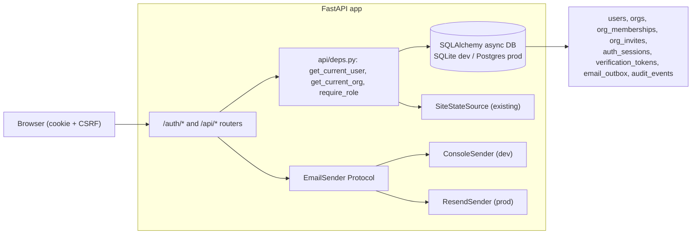
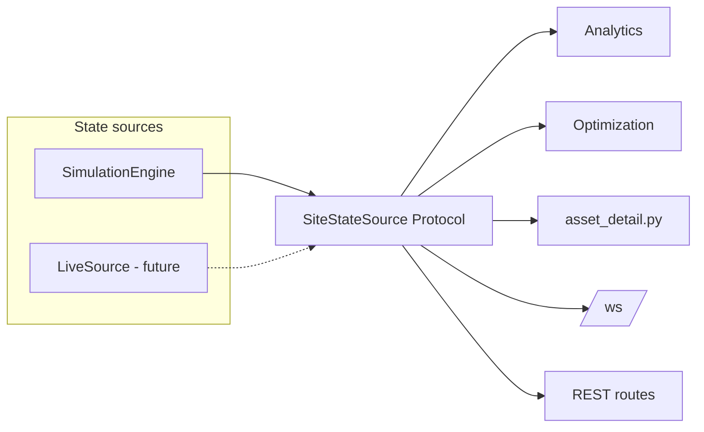

# SiteIQ — Claude Context

## What this is

SiteIQ is an interactive demo of a construction site intelligence product. The thesis: construction sites are catastrophically inefficient — workers are productive only 35% of their time. SiteIQ uses cameras + CV to observe everything on a site, quantify waste in euros, and prescribe specific operational fixes.

For this demo, a **simulation engine** replaces real camera feeds. The simulation generates the same data that real CV would. The demo must make an investor or construction executive viscerally understand the waste and see it fixed in real time — in under 3 minutes, no narration needed.

## Architecture overview

Two disconnected systems exist today, gated by a self-hosted auth layer:

```
                              ┌────────── Frontend (React Router) ──────────┐
                              │  Public:                                    │
                              │   / LandingPage                             │
                              │   /login /signup /forgot-password           │
                              │   /reset-password /verify-email             │
                              │   /accept-invite                            │
                              │  Gated /app/*  (RequireAuth):               │
                              │   Dashboard + Settings (Account / Team /    │
                              │   Workspaces / Sessions)                    │
                              └────────────────┬────────────────────────────┘
                                               │ cookie + CSRF
                                               ▼
SIMULATION (the demo)                    VISION (disconnected proof-of-concept)
┌──────────────────────┐                 ┌─────────────────────────┐
│ SimulationEngine     │                 │ VideoDetector           │
│ - 50–60 workers FSM  │                 │ - YOLOv8n on .mp4 files │
│ - equipment duty     │                 │ - base64 JPEG frames    │
│   cycles             │    NO LINK      │ - bounding box coords   │
│ - position trails    │◄──────────────►│ - confidence scores     │
│ - analytics/waste    │                 │                         │
│ - recommendations    │                 │ Serves: /ws/camera/{id} │
│                      │                 └─────────────────────────┘
│ Serves: /ws (10Hz)   │                            ▲
│         /api/*       │                            │ all gated by
└──────────┬───────────┘                            │ Depends(get_current_org)
           │ all gated by Depends(get_current_org)  │
           └────────────────┬───────────────────────┘
                            │
                            ▼
                ┌──────────────────────────────────┐
                │ FastAPI app                      │
                │  /auth/*  /api/*  /api/orgs/*    │
                │  CSRF middleware + Origin check  │
                │  CORS  Error envelope handler    │
                │  app.state: db engine, email     │
                │  sender, limiter, source, recs   │
                └──────────────┬───────────────────┘
                               │
                               ▼
                ┌──────────────────────────────────┐
                │ SQLAlchemy async (SQLite|Postgres)│
                │ users, orgs, memberships, invites│
                │ sessions, tokens, outbox, audits │
                └──────────────────────────────────┘
```

The camera feeds and the simulation are still not synchronized — see the
"Architectural debt" section. The product story is "cameras → intelligence
→ decisions" but the demo shows two unrelated systems side by side.

### What "Live Mode" should eventually look like

```
Real cameras → YOLO inference → Camera calibration → 2D site map
                                (pixel → meter transform)
                                        │
                                        ▼
                              Same analytics/optimization
                              pipeline as simulation mode
```

The simulation engine would be replaced by real detection data projected onto the site plan.

## Tech stack

| Layer | Technology |
|-------|-----------|
| Backend | Python 3.13, FastAPI, uvicorn, WebSocket, Pydantic v2, pydantic-settings |
| Persistence | SQLAlchemy 2.0 async, Alembic, aiosqlite (dev/test) / asyncpg (prod) |
| Auth | argon2-cffi (passwords), opaque server-side sessions, slowapi (rate limit), httpx (Resend) |
| Frontend | React 19, Vite 8, TypeScript 6, Tailwind CSS 3, HTML5 Canvas |
| Frontend libs | react-router-dom v6, react-hook-form, zod, @zxcvbn-ts (lazy), sonner |
| CV | ultralytics (YOLOv8n), opencv-python-headless |
| Package mgmt | uv (backend), npm (frontend) |
| Real-time | WebSocket at 10Hz for sim state, ~5Hz for camera frames |

## Running the app

```bash
# Backend
cd backend
uv sync
uv run alembic upgrade head           # creates ./siteiq.db on first run
uv run uvicorn main:app --host 0.0.0.0 --port 8000

# Frontend
cd frontend
npm install
npm run dev
# → http://localhost:5173
```

Settings are read from `backend/.env` (see `backend/.env.example` for every
`SITEIQ_*` knob). In dev mode the verification + reset emails are persisted
to the `email_outbox` table and visible at `http://localhost:8000/dev/outbox`
— no SMTP setup needed.

Camera feeds require .mp4 files in `backend/vision/videos/`. Two Pexels CC0
videos are downloaded but gitignored. YOLO model weights (`yolov8n.pt`)
auto-download on first run.

## Auth, orgs, and persistence

A self-hosted auth stack sits in front of every `/api/*` and WebSocket
route. SQLite drives dev/test (zero setup), Postgres drives prod — both
behind one async SQLAlchemy 2.0 engine selected via `SITEIQ_DATABASE_URL`.



### Sessions, not JWTs
Opaque tokens live in `auth_sessions`; the cookie holds the plaintext,
the DB holds `sha256(token)`. Revocation, sliding expiry, and "sign out
everywhere" are all single SQL updates. Cookie name uses the `__Host-`
prefix when `SITEIQ_COOKIE_SECURE=true` so browsers enforce Path=/, Secure,
no Domain.

### CSRF
Double-submit cookie pattern (`siteiq_csrf` cookie + `X-CSRF-Token` header)
plus an `Origin` allow-list checked on every state-changing request.
WebSockets share the same Origin allow-list and re-verify the session
cookie at upgrade.

### Email
`EmailSender` Protocol mirrors the `SiteStateSource` seam. `ConsoleSender`
persists to `email_outbox`; the same rows are visible at `/dev/outbox`
when `SITEIQ_ENV=dev`. `ResendSender` posts to api.resend.com via httpx
and updates the same row's status. Tests assert against the outbox.

### Orgs + roles
Signup auto-creates an Org named after the company; the user is its
owner. Roles (owner > admin > member > viewer) are checked via
`Depends(require_role(Role.ADMIN))`. Invites are 7-day single-use tokens
keyed to the invitee's email. Every membership change writes an
`audit_events` row (visible to owners on Settings → Team).

### New backend modules
- `db/` — async engine factory + ORM models + `get_db` dependency.
- `auth/` — `passwords.py` (argon2id), `tokens.py`, `sessions.py`,
  `csrf.py`, `rate_limit.py`, `email_sender.py`, `email_templates.py`,
  `service.py`, `routes.py`, `errors.py`, `timeutil.py`.
- `orgs/` — invite/membership service + routes.
- `api/dev.py` — `/dev/outbox` (mounted only when env=dev).
- `api/ws_auth.py` — origin + cookie check shared by `/ws` and `/ws/camera/*`.
- `alembic/` — migrations; one revision (`0001_init_auth`) creates every auth table.

Every existing protected route is wrapped with `Depends(get_current_org)`,
so unauthenticated requests get the canonical `{error: {code, message}}`
401 envelope. The simulation itself stays a single global engine for
v1; per-org engines are a future move and the `SiteStateSource` Protocol
already supports it.

### Frontend auth
- Top-level `BrowserRouter` in `App.tsx` with public routes (`/`,
  `/login`, `/signup`, `/forgot-password`, `/reset-password`,
  `/verify-email`, `/accept-invite`) and gated `/app/*`.
- `lib/auth/AuthProvider.tsx` boots via `GET /auth/me`, exposes
  `useAuth()` everywhere. `RequireAuth` redirects to `/login?next=…`,
  `RequireRole` shows an "Access denied" panel.
- `services/api.ts` extends `getJson`/`postJson` with `credentials:
  'include'` and an `X-CSRF-Token` header sourced from `/auth/csrf`.
  All errors throw `ApiError` so forms can render `error.field`.
- `pages/LandingPage.tsx` uses the same orange + JetBrains Mono tokens
  as the dashboard, with a `LiveWasteCounter` that ticks up while the
  user reads — same metric the dashboard surfaces, so the funnel feels
  coherent.
- `pages/settings/*` covers Account (change password, resend
  verification), Team (members, invites, audit log for owners),
  Workspaces (org switcher), and Sessions (per-device revoke + sign
  out everywhere).

## Backend architecture (post-refactor)

The backend follows a **state-source seam** so the simulation and (future) live-CV mode share the entire analytics + optimization + API surface. Every consumer depends only on the `SiteStateSource` Protocol, not on `SimulationEngine`. Long-lived objects live on `app.state` and are injected via FastAPI `Depends` — no module-level globals.



## Backend modules

### `config.py`
Domain constants only (rates, intervals, sim-clock parameters). Operational knobs live in `settings.py` instead.
Key tunables: `TOILET_INTERVAL` (7200s = 2h), `MATERIAL_RUN_INTERVAL` (7200s), equipment hourly rates (€180/120/90 for crane/pump/excavator), `SIM_SECONDS_PER_TICK` (30 — each 100ms real tick = 30s sim time at 1× speed).

### `settings.py`
`Settings` (pydantic-settings `BaseSettings`) with `SITEIQ_*` env-var overrides. Beyond CORS / log / YOLO knobs the auth-era fields are: `env` (`dev|prod|test`), `database_url`, `frontend_origin`, `session_secret`, `session_cookie_name`, `session_lifetime_days`, `session_idle_days`, `cookie_domain`, `cookie_secure`, `email_provider` (`console|resend`), `resend_api_key`, `email_from`, `rate_limit_redis_url`. Convenience properties: `is_prod`, `is_dev`, `effective_cookie_secure` (defaults to `True` in prod, `False` in dev). Documented in `backend/.env.example`.

### `logging_config.py`
`configure(level, fmt)` installs one stream handler on the root logger. `fmt="json"` swaps in `python-json-logger`'s `JsonFormatter`. Idempotent — safe to call repeatedly. Every backend module uses `logging.getLogger(__name__)`. Zero `print(...)` calls; zero bare `except Exception: pass` (guardrail tests in `test_logging.py`).

### `state/`
- **`source.py`** — `SiteStateSource` Protocol (`@runtime_checkable`). Surface: `project_id`, `sim_time`, `sim_day`, `site`, `assets`, `asset_by_id`, `zone_by_id`, `workers_in_zone`, `worker_internals_for`, `activity_log_for`, `position_history_for`. Both `SimulationEngine` and (future) `LiveSource` implement this.

### `models/`
Pydantic v2 schemas. `Site` has zones + schedule. `Asset` has position, state, metadata. `WasteSummary` aggregates costs. `Recommendation.from_position` / `to_position` use the typed `PositionXY` model.

`Asset.to_broadcast_dict()` produces the compact WebSocket payload — flat dict with id, type, subtype, x, y, state, assigned_zone.

### `simulation/`
- **`site_factory.py`** — `PROJECT_TEMPLATES` dict with 3 German construction projects (residential Berlin, commercial Frankfurt, infrastructure Munich). Each defines zones, facilities, equipment, materials, schedule, and worker counts. `create_site_from_template(project_id)` instantiates a full simulation state. Returns `(Site, list[Asset], dict[str, WorkerInternals])`.

- **`engine.py`** (~140 LOC, down from 243) — `SimulationEngine` implements `SiteStateSource`. Owns `assets`, `site`, `worker_internals`, `position_history`, `activity_log`, plus three O(1) indexes (`_by_id`, `_facilities_by_subtype`, `_workers_by_zone`) rebuilt on every project switch via `rebuild_indexes()`. `tick()` advances the FSM; `get_state_snapshot()` produces the WS broadcast payload. `load_project()` hot-swaps + re-indexes.

- **`worker_internals.py`** — `@dataclass WorkerInternals` typed state per worker (FSM timers, dwell counters, daily-reset stats). Replaces the old `dict[str, Any]` access. `reset_daily()` clears day-level counters.

- **`worker_behavior.py`** — Worker FSM with dispatch table: `STATE_HANDLERS: dict[WorkerState, StateHandler]` maps each state to a single-purpose `_on_*` handler (`_on_working`, `_on_walking_to_toilet`, `_on_at_toilet`, `_on_walking_to_material`, `_on_carrying_material`, `_on_walking_to_break`, `_on_at_break`, `_on_walking_to_work`). Adding a state means: write a handler + add one line. Uses engine's indexed lookups via the local `_WorkerEngine` Protocol (`facilities_by_subtype`, `materials`). Strict-mypy clean.

- **`equipment_behavior.py`** — Alternates OPERATING ↔ IDLE on duty cycles (crane 40/30min, pump 10/40min, excavator 42/18min). Tracks hours_active/hours_idle.

- **`asset_detail.py`** — `asset_detail(source, asset_id)` builds the rich per-asset detail view. Dispatch table `DETAIL_BUILDERS` routes by `asset.type` to `_worker_detail` / `_equipment_detail` / `_facility_detail` / `_material_detail`. Per-type radius + state tables for facility occupancy. Replaces the old 130-LOC `engine.get_asset_detail()` god-method.

### `analytics/`
All take `source: SiteStateSource`, not the engine.
- **`travel.py`** — `compute_travel_metrics(source)`. Per-zone metrics: avg toilet round-trip, trips/day, daily walk cost (trips × RT × hourly_rate), productivity rate. Extrapolates partial-day data via `day_fraction`.
- **`utilization.py`** — `compute_equipment_utilization(source)`. Per-equipment: utilization rate, daily idle cost (normalized to 11h workday × idle_fraction × rate).
- **`aggregator.py`** — `compute_waste_summary(source)`. Combines travel + equipment into `WasteSummary` with daily and monthly totals.

### `optimization/`
All take `source: SiteStateSource`.
- **`facility_placement.py`** — Weighted k-means (k=2) on zone centers; greedy-nearest pairing assigns toilets to centroids.
- **`material_staging.py`** — Picks the zone edge closest to the material's current position to preserve gate-side logistics flow.
- **`equipment_schedule.py`** — Flags equipment <40% utilization for release, <60% for rescheduling. Daily idle hours = `(1 - utilization) × 11h` — stable from t=0.

### `services/`
- **`recommendation_service.py`** — `RecommendationService(source, optimizers=…)`. Owns the recommendation cache; tracks the project id of the cached set and auto-invalidates on mismatch. `get()`, `clear()`, `mark_dirty()`, `by_id()`. Constructed once per app at lifespan startup, injected via `Depends(get_rec_service)`.

### `api/`
- **`deps.py`** — FastAPI dependency providers. Domain: `get_source`, `get_rec_service`, `get_detector`, `get_analytics`, `get_settings`, `get_email_sender` (all 503 if `app.state` isn't ready). Auth: `get_optional_session`, `get_current_session`, `get_current_user`, `get_current_org`, `get_current_membership`, `require_role(min: Role)` (closure-style Depends, returns 403 below threshold).
- **`routes.py`** — REST routes, all wrapped in `Depends(get_current_org)`. GET `/api/projects`, `/api/portfolio`, `/api/site`, `/api/recommendations`, `/api/assets/{id}`, `/api/simulation/state`, `/api/simulation/heatmap`. POST `/api/projects/{id}/load`, `/api/recommendations/{id}/apply`, `/api/recommendations/apply-all`, `/api/simulation/speed`, `/api/simulation/pause`. Sim-only controls return 501 if the source isn't a `SimulationEngine`.
- **`websocket.py`** — WS `/ws` streams `state_update` at 10Hz (assets + trails + latest analytics). Auth: cookie + origin checked at upgrade via `api/ws_auth.py`.
- **`camera.py`** — GET `/api/cameras` lists video feeds. WS `/ws/camera/{video_id}` streams YOLO-processed frames at ~5Hz via `asyncio.to_thread()` so inference doesn't stall the event loop. Same cookie + origin check as `/ws`.
- **`ws_auth.py`** — `authenticate_ws(websocket)`: rejects unknown Origins with close code 4403, missing/invalid session with 4401. Shared by both WebSocket endpoints.
- **`dev.py`** — `/dev/outbox` (mounted only when `env=dev`). Lists the most recent 100 emails for inspection during development; matching `/dev/outbox/{id}/html` serves the rendered email body.

### `vision/`
- **`detector.py`** — `VideoDetector` wraps YOLOv8n. Loads all .mp4 from `vision/videos/`, reads frames with OpenCV, runs inference (conf=0.20), returns base64 JPEG + normalized bounding boxes. CLASS_REMAP maps COCO classes to construction labels ("person" → "Worker"). ~18ms inference per frame on Apple Silicon.

### `main.py`
Thin composition root. `create_app(settings=None)` builds an isolated FastAPI app (tests can pass custom settings). Lifespan handler constructs the async DB engine + session factory, the `EmailSender` (Console or Resend), the slowapi limiter, the `SimulationEngine`, the `RecommendationService` and the `VideoDetector` — all attached to `app.state`. Then spawns `run_simulation_loop` + `_run_analytics_loop`. Middleware order: CORS → CSRF (double-submit cookie + Origin allow-list, exempts `/auth/csrf` + `/ws/*`) → routers (`/auth`, `/api/orgs`, `/api`, `/ws`, `/ws/camera`, plus `/dev/*` only in dev). A custom exception handler converts `HTTPException` and `RequestValidationError` into the standard `{error: {code, message, field?}}` envelope. No module-level globals.

## Test suite

| Suite | File | Count | Covers |
|---|---|---|---|
| Bug regressions | `tests/test_bug_fixes.py` | 19 | Bugs #1, #11, #12, #16-#28 |
| HTTP API | `tests/test_api.py` | 9 | All REST endpoints via TestClient (with auth fixture) |
| Async / YOLO offload | `tests/test_event_loop.py` | 2 | Bug #2 |
| Edge cases | `tests/test_edge_cases.py` | 14 | Long sim, project flipping, etc. |
| `SiteStateSource` Protocol | `tests/test_state_source.py` | 9 | Consumers depend only on Protocol |
| DI | `tests/test_di.py` | 5 | No module globals, `app.state` isolated per app |
| `WorkerInternals` dataclass | `tests/test_worker_internals.py` | 7 | Typed state contract |
| `asset_detail` builders | `tests/test_asset_detail.py` | 16 | Per-builder behavior + engine LOC budget |
| Worker FSM dispatch | `tests/test_worker_fsm.py` | 15 | Each state handler in isolation |
| Engine index perf | `tests/test_engine_perf.py` | 6 | O(1) lookups, project-switch invalidation |
| `Settings` | `tests/test_settings.py` | 8 | Env overrides, validation |
| Logging | `tests/test_logging.py` | 7 | No prints, no bare excepts, structured fields |
| Heatmap | `tests/test_heatmap.py` | 7 | Density grid + sparse encoding |
| DB engine + migrations | `tests/test_db.py` | 3 | URL switching, Alembic upgrade clean on SQLite |
| argon2 passwords | `tests/test_auth_passwords.py` | 4 | Round-trip, bad-password rejection, salt uniqueness |
| `/auth/*` routes | `tests/test_auth_routes.py` | 11 | Signup/login/logout, CSRF, verify, reset, sessions |
| `/api/orgs/*` routes | `tests/test_orgs.py` | 7 | Auto-org-on-signup, invites, role gating, audit |
| `EmailSender` | `tests/test_email_sender.py` | 4 | Console outbox + Resend httpx_mock + 5xx |
| AuthZ | `tests/test_authz.py` | 3 | 401 without cookie, role gates 403 |
| **Total backend** | | **156** | |
| Frontend | `frontend/src/**/*.test.{ts,tsx}` | 52 | Sim canvas + auth (AuthProvider, RequireAuth), api.ts |
| **Total** | | **208** | |

Mypy strict scoped to `simulation/worker_internals.py`, `simulation/worker_behavior.py`, `state/source.py` — clean.

`tests/conftest.py` exposes:
- `engine` / `frankfurt_engine` / `munich_engine` — fresh `SimulationEngine` instances.
- `app_settings` — `Settings` pointing at a per-test SQLite file with `env=dev`.
- `app_factory` / `client` — applies migrations, swaps in the no-op detector + `cheap_hasher` for argon2, builds a `TestClient`.
- `auth_client` — `client` with a real signed-up user + session cookie + CSRF header preset; the standard fixture for auth-gated routes.
- `authenticate(client)` / `setup_test_db(url)` — helpers for tests that build their own app variants (e.g. `test_di`, `test_settings`).

## Frontend modules

### State management
- `App.tsx` is now a `BrowserRouter`. The simulation app body lives in `pages/Dashboard.tsx`, mounted at `/app` behind `<RequireAuth>`.
- `lib/auth/AuthProvider` — context that boots via `GET /auth/me`, exposes `useAuth()` (`status`, `user`, `org`, `memberships`, `refresh`, `setMe`) everywhere. `RequireAuth` redirects to `/login?next=…`; `RequireRole` shows an "Access denied" panel if below threshold.
- `useWebSocket` — connects to `${WS_BASE}/ws`, stores assets + trails in **refs** (not state) for canvas performance. Only analytics, simTime, simDay trigger React re-renders.
- `useSimulation` — fetches `/api/site` on mount. `reload()` re-fetches after project switch.
- `useAnalytics` — captures first analytics as baseline, computes savings delta. `resetBaseline()` clears on project switch.
- Recommendations fetched in `Dashboard.tsx` via useEffect + 5s polling (not inside the Optimize tab component). The dashboard also resets selection / recs / baseline whenever the active org id changes.

### Canvas rendering (`renderer.ts`, 768 lines)
Module-level coordinate helpers `px()`, `py()`, `ps()` set from scale/offset each frame. Draws in order: ground → roads → fence → zone structures (phase-specific: excavation contours, foundation grids, structural columns, MEP conduit routes, finishes partitions) → heatmap → trails → materials → facilities → equipment → workers → recommendation arrows → selection highlight → scale bar → legend.

Workers rendered as emoji (👷) with trade-colored dot underneath. Equipment as emoji (🏗️🚛🚜) with status ring and ACTIVE/IDLE label. Facilities as emoji (🚻☕🏢🔧) on background plates. Materials as emoji (🪨🔌🧱🪣).

Selection: pulsing orange ring + tooltip with asset ID. Selected worker's trail at full opacity, others dimmed to 4%.

### `CameraFeed.tsx`
Connects to `ws://localhost:8000/ws/camera/{videoId}`. Receives base64 JPEG + detection data. Renders video frame on canvas, overlays bounding boxes with corner brackets, class labels, confidence %, inference time, detection count HUD. Shows "● REC" indicator and "YOLOv8 · SiteIQ Vision" badge.

### `SiteMap.tsx`
Canvas container with pan (drag), zoom (scroll wheel), reset (double-click). Click detection: converts screen coords → site meters via scale/offset/zoom/pan back-projection, finds nearest asset within hit radius, sets selectedAssetId. Cursor changes to pointer on hover over assets. Toggle bar: Trails, Heatmap, Show Fixes, Cameras.

### Right panel
Tabbed: Waste / Optimize / Timeline. Asset detail replaces tabs when an asset is selected.

- **WasteReport** — Red "RECOVERABLE WASTE" hero with monthly + daily framing. ROI card (system cost €2K/mo vs savings, payback ratio). "Included at no extra cost" card showing BauWatch/PPE/Buildots replacements. Three expandable cost rows with zone/equipment breakdowns. Green CTA "Apply optimizations — recover €X/mo" links to Optimize tab.

- **Recommendations** — "Available Savings" banner with monthly + annual total. "Apply All N Optimizations" button with spinner state. Individual recommendation cards with Apply buttons. Post-apply celebration card with annual savings. Applied list at bottom.

- **Timeline** — Gantt chart from schedule data. Hardcoded lookahead text (not driven by simulation — known limitation).

- **AssetDetail** — Worker: productivity bar (work/walk/facility split), distance, trips, round-trip times. Equipment: utilization gauge, duty cycle progress. Facility: workers present list. Material: target zone + distance. Activity log with sim-clock timestamps.

### `Portfolio.tsx`
Full-screen view showing all 3 project templates. Summary cards (sites, workers, equipment, waste). Portfolio ROI banner. Per-site cards with Open Site button that triggers project switch.

## Design system
Light theme using HSL CSS custom properties (shadcn-style tokens). Primary = orange (24 80% 50%), destructive = red, success = green, warning = amber. Inter for UI, JetBrains Mono for numbers. All monetary values use `tabular-nums` for stable width.

## Known issues and debt

Bugs 1–32 below were all identified during the original audit and have been
fixed in the working tree. Each entry retains its original description and now
ends with a `→ Fix:` note describing what was actually changed. Architectural
debt items 33–38 remain open.

### Bugs (verified by reading every route handler and data flow)

1. **Recommendation cache not cleared on project switch.** `routes.py:load_project()` clears `_recommendations_cache` (a dead module-level var in routes.py, line 8) but the real cache is `cached_recommendations` in `main.py`. The `recs_dirty` flag only flips on the next analytics tick (~1s later). Between project load and that tick, stale recs from the old project can be served.
   → Fix: `main.py` exposes `clear_recommendations_cache()`, passed into `init_routes`. `routes.load_project` calls it on switch. `get_recommendations()` also re-checks `engine.project_id` against a cached `cached_project_id` and forces a refresh on mismatch. The dead `_recommendations_cache` var in `routes.py` is removed.

2. **YOLO inference blocks the async event loop.** `camera.py` line 36 calls `_detector.get_next_frame()` synchronously (~18ms of OpenCV + YOLO per frame, per connected camera). During inference, the entire FastAPI event loop stalls — sim WebSocket pushes, REST endpoints, everything.
   → Fix: `camera.py` now runs `_detector.get_next_frame` via `asyncio.to_thread()`, freeing the event loop during OpenCV/YOLO work.

3. **No fetch error handling in frontend.** Every function in `api.ts` does `fetch(url).then(r => r.json())` without checking `r.ok` or `r.status`. A backend 500 or network error returns `undefined` which propagates silently through the UI. Any transient failure (e.g., during project switch) can put components into broken states.
   → Fix: introduced shared `getJson<T>()` / `postJson()` helpers in `api.ts` that throw on non-2xx. All API functions go through them. Existing call sites already use `.catch()` so errors no longer silently produce `undefined`.

### Frontend bugs (verified by reading every component)

4. **`justAppliedAll` never resets in `Recommendations.tsx`.** Set to `true` on Apply All (line 27), never set back to `false`. The celebration card stays visible forever — survives rec refreshes and project switches. Only clears on full page reload.
   → Fix: replaced boolean state with a `celebrationSig` (the recommendation-set signature captured when Apply-All ran). The card is visible only while the current recsSignature still matches, so a project switch or new rec set auto-hides it. A timer also auto-clears it after 8 s.

5. **Three hardcoded `localhost:8000` URLs outside `api.ts`.** `useWebSocket.ts` line 28, `CameraFeed.tsx`, `SiteMap.tsx` line 32.
   → Fix: `api.ts` exports `API_BASE` and `WS_BASE`. `useWebSocket.ts`, `CameraFeed.tsx`, and `SiteMap.tsx` (now via a new `fetchCameras()` helper) all import them. Single source of truth.

6. **WebSocket reconnect can create duplicate connections.** `useWebSocket.ts` line 26 checks `readyState === OPEN` but a WS in `CONNECTING` state (0) passes the guard.
   → Fix: guard now skips when an existing socket is OPEN *or* CONNECTING.

7. **`handlePortfolioSelect` in `App.tsx` ignores its `projectId` parameter.**
   → Fix: parameter removed from the implementation (TypeScript allows fewer params than the prop signature). A comment explains why: `Portfolio.tsx` calls `loadProject(id)` before invoking the callback.

8. **Portfolio ROI uses hardcoded 0.65 recovery factor.**
   → Fix: extracted to a named constant `RECOVERABLE_WASTE_FRACTION = 0.55` (centered on the doc'd 40–65% post-apply reduction range) plus `SYSTEM_COST_PER_SITE = 2000`. Computation flows from those.

### Renderer bugs (`renderer.ts`)

9. **`ctx.measureText` before `ctx.font` in zone labels.**
   → Fix: reordered — `ctx.font` set first, then `measureText`. Label backgrounds now size correctly.

10. **Module-level mutable state (`S`, `OX`, `OY`).** Would break if two canvases rendered simultaneously.
    → Mitigated: full refactor would touch 68 call sites; instead documented the invariant (synchronous render, single-threaded JS, reset at the top of every `renderFrame`). Listed in code comments with the explicit instruction to pass transform state explicitly if a second renderer instance is ever added. The bug is dormant in current architecture.

### Simulation logic bugs

11. **Worker gets permanently stuck if no facility exists.** Timer stays negative forever.
    → Fix: when `_find_nearest` returns `None`, the timer is now re-jittered to a fresh positive value before returning. The worker no longer pins on an unresolvable check every tick.

12. **k-means toilet assignment is order-based, not distance-based.**
    → Fix: toilets are now greedily paired to their *nearest* cluster centroid; sort+nearest-pair pass replaces `enumerate(toilets)`.

### Timeline bugs

13. **Timeline hardcodes zone IDs and TOTAL_DAYS=120.**
    → Fix: `Timeline.tsx` now takes `zones` as a prop and derives the zone list (preserves real labels like "Turm Ost"). `TOTAL_DAYS` is computed from `max(schedule.end_day, currentDay + 5, 120)`, so the Munich bridge (day 210) and any future longer schedule render correctly. Day markers are rebuilt for the actual span. `App.tsx`/`RightPanel.tsx` plumb zones through.

### Additional frontend issues

14. **CameraFeed RAF loop restarts 5x/sec.** `useEffect` deps include `detectionCount` and `inferenceMs`.
    → Fix: stats moved into refs (`detectionCountRef`, `inferenceMsRef`); deps reduced to `[connected, label]`. The RAF loop now mounts once.

15. **CameraFeed has no WebSocket reconnection.**
    → Fix: added the same exponential-backoff reconnect loop used in `useWebSocket` (1 s → 10 s cap), with cancellation on unmount.

16. **AssetDetail zone name is reformatted ID, not actual label.**
    → Fix: backend `engine.get_asset_detail()` now emits `assigned_zone_label` and `needed_in_zone_label`. Frontend prefers the label, falls back to the ID.

17. **MaterialDetail zone name regex doesn't capitalize zone letter.**
    → Fix: superseded by #16 — uses real `needed_in_zone_label` from the backend instead of regex-mangling the ID.

18. **EquipmentDetail duty cycle progress bar is wrong during idle.**
    → Fix: cycle denominator now switches between `operate_duration_s` / `idle_duration_s` based on `data.state` (`operating` vs `idle`).

19. **`onMouseUp` doesn't restore cursor to `grab`.**
    → Fix: `onMouseUp` now resets `canvas.style.cursor = 'grab'` before handling the click.

20. **`onMouseMove` registered on both canvas AND window.**
    → Fix: dropped the canvas-level listener; kept only the window-level one (which already handles both hover and drag-while-outside-canvas).

21. **`AssetUpdate` type missing `assigned_zone`.**
    → Fix: added `assigned_zone?: string` to the interface.

22. **`formatCurrencyCompact` exported but never used.**
    → Fix: removed.

### Backend logic issues found on full read

23. **`equipment_schedule.py` `daily_idle_hours` formula is unstable.**
    → Fix: replaced `hours_idle * (11.0 / max(total, 0.1))` with `(1.0 - utilization) * WORKDAY_HOURS`. Stable from t=0.

24. **`equipment_schedule.py` hardcodes fallback zone "D".**
    → Fix: now resolves the actual zone label via `engine.get_zone_by_id`, falling back to "its current zone" when none is assigned.

25. **`material_staging.py` picks zone edge nearest to center, not to material.**
    → Fix: candidates are now scored by distance from the material's current position (the staging side closest to the existing logistics path), not by distance from the zone center.

26. **Facility detail only checks toilet/breakroom.**
    → Fix: per-subtype radius table + per-subtype required-state table. `office` and `toolcrib` now report any nearby worker (no required state).

27. **`EquipmentState.REPOSITIONING` defined but never used.**
    → Fix: removed.

28. **`Recommendation.from_position` and `to_position` are untyped `dict`.**
    → Fix: introduced `PositionXY` Pydantic model; both fields now use it. Route handler updated from `rec.to_position["x"]` → `rec.to_position.x`.

### Dead code (all removed)

29. ~~`CONSTRUCTION_CLASSES` dict in `detector.py`~~ — removed.
30. ~~`_recommendations_cache` in `routes.py`~~ — removed (see #1).
31. ~~`_find_nearest_facility` in `travel.py`~~ — removed.
32. ~~`MetricCard.tsx`~~ — file deleted.

### Architectural debt (still open)

33. **Camera feeds are disconnected from simulation** — the core coherence problem. See architecture section above. The `SiteStateSource` Protocol seam already supports a future `LiveSource` that would replace the simulation engine with calibrated YOLO detections projected onto the 2D map.
34. **Timeline lookahead is hardcoded** — static text in `Timeline.tsx`, not driven by simulation state. Damages trust if questioned.
35. **Portfolio waste estimates are rough** — uses a fixed formula (`workers * 50 * 0.12 * 22 + equipment * 150 * 0.4 * 11 * 22`), not actual simulation data per project.
36. **Per-org custom projects deferred.** The 3 `PROJECT_TEMPLATES` are still shared across orgs (one global `SimulationEngine`). Schema reserves space for `org_projects` later; `get_current_org` only gates access — it does not yet route to a per-org engine.
37. **No 2FA UI yet.** The `users.totp_secret` column exists; the UI is intentionally hidden behind a future feature flag.
38. **No billing.** `orgs.plan` exists (`trial|pro|enterprise`) but Stripe integration is a separate plan.

### Resolved in the auth/orgs PR (2026-06-21)

- ~~**CORS hardcoded** to localhost:5173/5174~~ — `SITEIQ_CORS_ORIGINS` (comma-separated env var) drives the allow-list.
- ~~**No tests** — empty `tests/__init__.py`~~ — backend is at 156 tests across 19 suites, frontend at 52.
- ~~**No auth, no persistence, no database**~~ — full self-hosted auth + SQLAlchemy/Alembic/SQLite-or-Postgres + audit log. See "Auth, orgs, and persistence" above.

### API route → frontend mapping (verified)

Every `/api/*` route below is wrapped in `Depends(get_current_org)` and
returns the standard `{error: {code, message, field?}}` envelope on failure.
Mutating requests carry `credentials: 'include'` + `X-CSRF-Token`.

**Auth**

| Backend route | Method | Frontend caller | Notes |
|--------------|--------|----------------|-------|
| `/auth/csrf` | GET | `services/api.ts` (auto) | Sets `siteiq_csrf` cookie + returns body token; cached client-side |
| `/auth/me` | GET | `AuthProvider` boot | Returns `{user, org, memberships}` — `null`s when anonymous |
| `/auth/signup` | POST | `SignupPage` | Creates user + org (owner) + session; sends verification email |
| `/auth/login` | POST | `LoginPage` | Returns `MeResponse` and sets session cookie |
| `/auth/logout` | POST | `SettingsLayout` | Revokes the active session, clears cookie + CSRF cache |
| `/auth/forgot-password` | POST | `ForgotPasswordPage` | Always 200 — never reveals whether the email exists |
| `/auth/reset-password` | POST | `ResetPasswordPage` | Consumes single-use token, revokes all sessions, issues a fresh one |
| `/auth/verify-email` | POST | `VerifyEmailPage` | Single-use token, 24h TTL |
| `/auth/resend-verification` | POST | `AccountSettings` | No-op if already verified |
| `/auth/change-password` | POST | `AccountSettings` | Revokes every other session for the user |
| `/auth/sessions` | GET | `Sessions` | Live (non-revoked, non-expired) sessions for the current user |
| `/auth/sessions/{id}/revoke` | POST | `Sessions` | Per-device revoke |
| `/auth/sessions/revoke-all` | POST | `Sessions` | Sign out everywhere; reissues current cookie |

**Orgs**

| Backend route | Method | Frontend caller | Notes |
|--------------|--------|----------------|-------|
| `/api/orgs` | GET | `OrgSwitcher` | All memberships for current user |
| `/api/orgs/switch` | POST | `OrgSwitcher`, `AcceptInvitePage` | Sets `auth_sessions.current_org_id` |
| `/api/orgs/current/members` | GET | `TeamSettings` | member+ |
| `/api/orgs/current/invites` | GET | `TeamSettings` | admin+ |
| `/api/orgs/current/invites` | POST | `TeamSettings` | admin+; sends invite email |
| `/api/orgs/accept-invite` | POST | `AcceptInvitePage` | Token + email-match check |
| `/api/orgs/current/members/{user_id}` | PATCH | `TeamSettings` | admin+; only owners can touch owner roles |
| `/api/orgs/current/members/{user_id}` | DELETE | `TeamSettings` | admin+ |
| `/api/orgs/current/leave` | POST | `Settings` (future) | Last-owner protection |
| `/api/orgs/current/audit` | GET | `TeamSettings` | owner only |

**Simulation (gated by current org)**

| Backend route | Method | Frontend caller | Notes |
|--------------|--------|----------------|-------|
| `/api/projects` | GET | `TopBar.tsx` via `fetchProjects()` | On mount |
| `/api/projects/{id}/load` | POST | `TopBar.tsx` via `loadProject()` | On project switch |
| `/api/portfolio` | GET | `Portfolio.tsx` via `fetchPortfolio()` | On mount |
| `/api/site` | GET | `useSimulation.ts` via `fetchSite()` | On mount + reload |
| `/api/recommendations` | GET | `Dashboard.tsx` via `fetchRecommendations()` | 5s polling |
| `/api/recommendations/{id}/apply` | POST | `Recommendations.tsx` via `applyRecommendation()` | On click |
| `/api/recommendations/apply-all` | POST | `Recommendations.tsx` via `applyAllRecommendations()` | On click |
| `/api/assets/{id}` | GET | `AssetDetail.tsx` via `fetchAssetDetail()` | 1.5s polling when selected |
| `/api/simulation/speed` | POST | `TopBar.tsx` via `setSimSpeed()` | On speed button click |
| `/api/simulation/pause` | POST | `TopBar.tsx` via `togglePause()` | On pause button click |
| `/api/simulation/state` | GET | *unused by frontend* | Exists as fallback, never called |
| `/api/simulation/heatmap` | GET | `SiteMap.tsx` (when toggled) | Sparse density grid, daily reset |
| `/api/cameras` | GET | `SiteMap.tsx` inline fetch | When cameras toggle enabled |
| `/ws` | WS | `useWebSocket.ts` | 10Hz sim state stream; cookie + Origin checked at upgrade |
| `/ws/camera/{id}` | WS | `CameraFeed.tsx` | ~5Hz YOLO frame stream; same cookie + Origin check |

**Dev only (`SITEIQ_ENV=dev`)**

| Backend route | Method | Purpose |
|--------------|--------|---------|
| `/dev/outbox` | GET | Lists last 100 emails (verification links, reset tokens, invites) |
| `/dev/outbox/{id}/html` | GET | Renders the HTML body for inspection |

## Target waste metrics (tuned and verified)

| Category | Daily | Monthly | Target range |
|----------|-------|---------|-------------|
| Toilet walks | ~€875 | ~€19K | €800-1,200/day |
| Material handling | ~€600 | ~€13K | €400-700/day |
| Equipment idle | ~€2,200 | ~€48K | €1,200-2,200/day |
| **Total** | **~€3,700** | **~€81K** | **€2,400-4,100/day** |

After applying all optimizations: waste drops ~40-65% depending on project.
